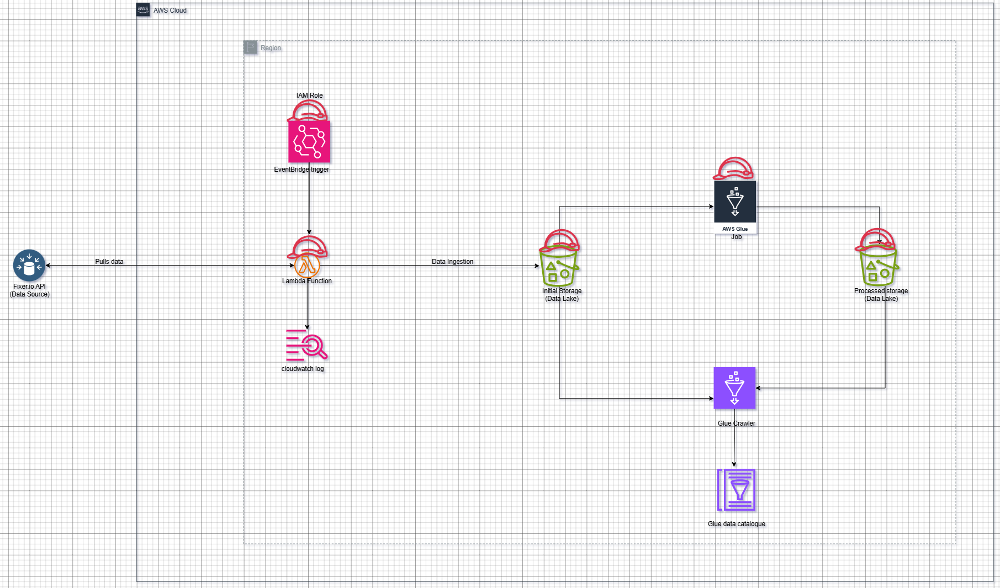

# 📊 Data Ingestion and ETL Pipeline with AWS (Terraform)

A production-ready, serverless ETL pipeline that automatically ingests real-time currency exchange rates from the Fixer API, processes them into analytics-ready format, and makes them queryable through SQL. Built entirely with AWS services and Infrastructure as Code (Terraform).



## 🏢 Business Use Case

Organizations such as **fintech companies, e-commerce platforms, and global businesses** need accurate and timely foreign exchange (FX) data.

* **Fintech apps** use live FX data for **currency conversion** in digital wallets.
* **E-commerce platforms** selling globally need daily FX rates to show **localized prices**.
* **Investment firms** track exchange rates to **analyze currency risks**.

This pipeline provides a **reliable, automated, and queryable FX dataset** without needing manual API calls or ad-hoc data dumps.

## ❓ Problem It Solves

1. **Raw API responses are not analysis-friendly** → Fixer API data is nested JSON with key-value pairs inside `rates`. Analysts can’t run SQL queries directly.
2. **Manual ingestion is error-prone** → Without automation, fetching and storing daily FX data requires scripts and human intervention.
3. **No unified data lake** → Businesses often lack a central place where raw + cleaned FX data is stored and queryable.
4. **Compliance & auditability** → Storing historical FX data in S3 ensures **immutability** and **audit trails** for reporting.

✅ This pipeline solves all of the above by:

* **Automating ingestion** with Lambda + EventBridge.
* **Transforming data** into a relational form using Glue ETL.
* **Cataloging both raw and processed data** for SQL queries via Athena.
* **Enabling cost-effective analysis** directly on S3 without provisioning databases.

## 🚀 Architecture

1. **Lambda Function (`fixer-api-function`)**

   * Runs every 12 hours (0:00, 12:00 UTC, EventBridge rule).
   * Fetches raw exchange rates from **Fixer API**.
   * Stores JSON response in the **Raw S3 Bucket** (`data-ingestion-bucket/raw/`).
   * Start the Glue ETL job

2. **AWS Glue ETL Job**

   * Reads raw JSON from the **Raw S3 Bucket**.
   * Flattens the nested `rates` object into rows of `(base_currency, date, currency, rate)`.
   * Writes processed data into the **Processed S3 Bucket** (`processed-data-bucket/processed/`).

3. **Glue Crawler + Data Catalog**

   * Crawls **both raw and processed buckets**.
   * Creates/updates tables inside the **Glue Data Catalog**:

     * `raw_currency_rates` → raw Fixer API responses
     * `processed_currency_rates` → cleaned, flattened ETL output
   * Makes both datasets queryable in **Athena**.

4. 🛡️**Security Features**

    * 🔐 Encrypted storage - S3 buckets with AES-256 encryption
    * 🔑 Secrets management - API keys stored in SSM Parameter Store
    * 🚫 Public access blocked - S3 buckets have public access restrictions
    * ⚡ Least privilege IAM - Minimal required permissions per service

## 🚀 Quick Start
**Prerequisites**

* AWS CLI configured with appropriate permissions
* Terraform >= 1.8.5 installed
* Valid Fixer.io API key

**1️⃣ Clone & Configure**

```
git clone https://github.com/Stefanie-A/currency-etl-pipeline.git

cd infrastructure
```
* Update your API key in main.tf
**2️⃣ Deploy Infrastructure**
```
terraform init
terraform plan
terraform apply
```
**3️⃣ Verify Deployment**
```
# Check Lambda function
aws lambda invoke --function-name fixer-api-function response.json
```
**Monitor in AWS Console**
* CloudWatch Logs: /aws/lambda/fixer-api-function
* S3 Buckets: Check for raw data files
* Glue Jobs: Monitor ETL execution

**Raw Data Structure (Input)**
```
json{
  "success": true,
  "timestamp": 1699123456,
  "base": "EUR",
  "date": "2024-01-15",
  "rates": {
    "USD": 1.095432,
    "GBP": 0.867891,
    "JPY": 162.434
  }
}
```
**Processed Data Structure (Output)**
```json
{"base_currency":"EUR","date":"2025-09-06","currency":"TZS","rate":2928.649806}
{"base_currency":"EUR","date":"2025-09-06","currency":"UAH","rate":48.191829}
{"base_currency":"EUR","date":"2025-09-06","currency":"UGX","rate":4112.789078}
{"base_currency":"EUR","date":"2025-09-06","currency":"USD","rate":1.17219}
{"base_currency":"EUR","date":"2025-09-06","currency":"UYU","rate":46.837598}
{"base_currency":"EUR","date":"2025-09-06","currency":"UZS","rate":14540.254313}
```
**📝 License & Support**

This project is licensed under the MIT License - see LICENSE file for details.